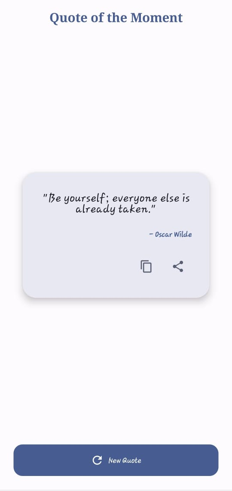
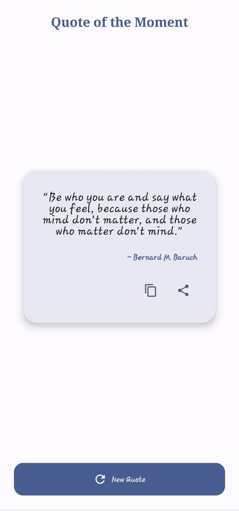

# 📜 Random Quote Generator

A modern Android application built with **Kotlin** and **Jetpack Compose** that displays inspiring quotes with a clean Material 3 interface. The app provides random quotes from a local collection and allows users to copy or share them effortlessly.

---

## ✨ Features

- 🎲 Display a random quote on app launch
- 🔄 Generate a new random quote
- 📝 30 locally stored quotes
- 🚫 Prevent consecutive duplicate quotes
- 📋 Copy quote to clipboard
- 📤 Share quote using Android Share Intent
- ✨ Smooth quote transition animations
- 🌗 Light & Dark Theme support
- 📱 Responsive Material 3 UI
- 🏗️ MVVM Architecture

---

## 🛠️ Tech Stack

- Kotlin
- Jetpack Compose
- Material 3
- MVVM Architecture
- Hilt (Dependency Injection)
- Navigation Compose
- Coroutines
- StateFlow
- AnimatedContent
- Android Clipboard API
- Android Share Intent

---

## 📸 Screenshots

| Home Screen | Add RQG |
|-------------|---------------|
|  |  |

---

## 🚀 Getting Started

1. Clone the repository.

```bash
git clone https://github.com/vek08/RQG.git
```

2. Open the project in **Android Studio**.
3. Sync Gradle.
4. Run the application on an emulator or Android device.

---

## 📂 Project Structure

```
app/
├── data/
├── domain/
├── di/
├── presentation/
├── navigation/
└── ui/
```

---

## 🎯 Learning Objectives

This project demonstrates:

- Android development with Jetpack Compose
- MVVM Architecture
- State Management using StateFlow
- Dependency Injection with Hilt
- Material 3 UI Design
- Android Clipboard & Share Intent
- Smooth UI animations

---

## 🤝 Contributing

Contributions are welcome! Feel free to fork this repository and submit a pull request.
